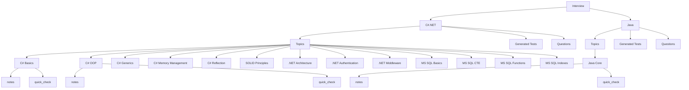

# 🌳 Obsidian Tree Structure Implementation Guide

Пошаговое руководство по созданию древовидной структуры навигации в Obsidian для вашего репозитория подготовки к интервью.

---

## 📊 Текущая структура данных

```
Interview/
├── C#.NET/
│   ├── Topics/
│   │   ├── C# Basics/
│   │   │   ├── notes.md
│   │   │   └── quick_check.md
│   │   └── C# OOP/
│   │       ├── notes.md
│   │       └── quick_check.md
│   ├── Generated Tests/
│   └── Questions/
└── Java/
    ├── Topics/
    │   └── Java Core/
    │       ├── notes.md
    │       └── quick_check.md
    ├── Generated Tests/
    └── Questions/
```

---

## 🎯 Цель: Древовидная структура

Создать визуальную иерархию:
```
Interview (Root)
├── C#.NET
│   ├── Topics
│   │   ├── C# Basics
│   │   │   ├── notes
│   │   │   └── quick_check
│   │   └── C# OOP
│   │       ├── notes
│   │       └── quick_check
│   ├── Generated Tests
│   └── Questions
└── Java
    ├── Topics
    │   └── Java Core
    │       ├── notes
    │       └── quick_check
    ├── Generated Tests
    └── Questions
```

---

## 📋 Метод 1: Native Obsidian (Zero Setup)

### Шаг 1.1: Использование папок и файлов

**Текущая структура уже правильная!** Папки создают естественную иерархию.

**Действия:**
1. Открой File Explorer (левая панель)
2. Структура уже отображается как дерево
3. Используйте `Ctrl/Cmd + Click` для раскрытия всех папок

**Преимущества:**
- ✅ Работает сразу, без плагинов
- ✅ Нативная навигация Obsidian
- ✅ Поиск по папкам

---

### Шаг 1.2: Mermaid Tree Diagrams

Создайте файл `Tree View.md` в корне:

```markdown
# 🌳 Interview Preparation Tree



**Как использовать:**
1. Создайте файл `Tree View.md` в корне репозитория
2. Вставьте код выше
3. Obsidian автоматически отрендерит дерево
4. Кликните на узлы для навигации (если добавите ссылки)

**Улучшенная версия с ссылками:**

```markdown
# 🌳 Interview Preparation Tree

```mermaid
graph TD
    A[Interview] --> B[[C#.NET/README|C#.NET]]
    A --> C[[Java/Java 2025-2026|Java]]
    
    B --> D[[C#.NET/Topics/README|Topics]]
    B --> E[[C#.NET/Generated Tests/README|Generated Tests]]
    B --> F[[C#.NET/Questions/README|Questions]]
    
    D --> G[[C#.NET/Topics/C# Basics/notes|C# Basics]]
    D --> H[[C#.NET/Topics/C# OOP/notes|C# OOP]]
    D --> I[[C#.NET/Topics/C# Generics/notes|C# Generics]]
    
    G --> G1[[C#.NET/Topics/C# Basics/notes|notes]]
    G --> G2[[C#.NET/Topics/C# Basics/quick_check|quick_check]]
```

---

## 🔌 Метод 2: Breadcrumbs Plugin (Рекомендуется)

### Шаг 2.1: Установка Breadcrumbs

1. Откройте Settings → Community Plugins
2. Отключите Safe Mode
3. Нажмите "Browse"
4. Найдите "Breadcrumbs"
5. Установите и активируйте

### Шаг 2.2: Настройка иерархии

**Вариант A: Использование папок (автоматически)**

Breadcrumbs автоматически определяет иерархию по папкам:
```
Interview/
  └── C#.NET/
      └── Topics/
          └── C# Basics/
              ├── notes.md (child of C# Basics)
              └── quick_check.md (child of C# Basics)
```

**Вариант B: Использование свойств (явная иерархия)**

Добавьте в frontmatter каждого файла:

**`C#.NET/Topics/C# Basics/notes.md`:**
```yaml
---
title: C# Basics — Основы C#
parent: [[../README|Topics]]
child: [[quick_check|Quick Check]]
---
```

**`C#.NET/Topics/README.md`:**
```yaml
---
title: Индекс тем - C#.NET
parent: [[../README|C#.NET]]
children:
  - [[C# Basics/notes|C# Basics]]
  - [[C# OOP/notes|C# OOP]]
  - [[C# Generics/notes|C# Generics]]
---
```

### Шаг 2.3: Настройка Breadcrumbs

1. Settings → Breadcrumbs → Hierarchy
2. Выберите "Folder Hierarchy" или "Property Hierarchy"
3. Включите "Show Breadcrumbs" в настройках отображения

**Результат:** Вверху каждого файла появится путь:
```
Interview > C#.NET > Topics > C# Basics > notes
```

---

## 🔌 Метод 3: Structured Tree Plugin

### Шаг 3.1: Установка

1. Community Plugins → Browse
2. Найдите "Structured Tree"
3. Установите и активируйте

### Шаг 3.2: Переименование файлов (опционально)

**Текущее имя:** `C#.NET/Topics/C# Basics/notes.md`  
**Новое имя:** `C#.NET.Topics.C# Basics.notes.md`

**⚠️ Внимание:** Это изменит структуру папок. Рекомендую использовать только если хотите плоскую структуру.

**Альтернатива:** Оставьте папки, Structured Tree работает и с ними.

### Шаг 3.3: Использование

1. Создайте новый файл `Tree Navigation.md`
2. Вставьте код:
```markdown
```structured-tree
root: Interview
depth: 5
```
```

3. Плагин автоматически построит дерево из папок

---

## 🤖 Метод 4: Автоматизация с Templater

### Шаг 4.1: Установка Templater

1. Community Plugins → Browse
2. Найдите "Templater"
3. Установите и активируйте

### Шаг 4.2: Создание шаблона для тем

Создайте файл `.obsidian/templates/topic-template.md`:

```markdown
---
title: <% tp.file.title %>
parent: [[../README|Topics]]
child: [[quick_check|Quick Check]]
category: <% tp.file.folder %>
---

# <% tp.file.title %>

**Навигация:** [[../README|← Topics]]

---

## 📚 Теория

[Ваш контент]

---

## 📖 Быстрая проверка
→ [[quick_check|Быстрый опросник]]

---

## 🔗 Навигация

← [[../README|Вернуться к списку тем]]
```

### Шаг 4.3: Скрипт для массового добавления свойств

Создайте файл `.obsidian/scripts/add-hierarchy-properties.js`:

```javascript
// Используйте с плагином "Custom JS" или через Templater

const files = app.vault.getMarkdownFiles();
const topicsPath = "C#.NET/Topics/";

files.forEach(file => {
    if (file.path.includes(topicsPath) && file.basename === "notes") {
        app.vault.process(file, (content) => {
            const frontmatter = `---
title: ${file.parent.name} — Конспект
parent: [[../README|Topics]]
child: [[quick_check|Quick Check]]
category: ${file.parent.parent.name}
---

`;
            
            // Проверяем, есть ли уже frontmatter
            if (!content.startsWith("---")) {
                return frontmatter + content;
            }
            return content;
        });
    }
});
```

---

## 📊 Метод 5: MOC (Map of Content)

### Шаг 5.1: Создание главного MOC

Создайте `Interview MOC.md` в корне:

```markdown
# 📚 Interview Preparation MOC

## C#.NET

### Topics
- [[C#.NET/Topics/README|📚 Все темы C#.NET]]
  - [[C#.NET/Topics/C# Basics/notes|C# Basics]]
  - [[C#.NET/Topics/C# OOP/notes|C# OOP]]
  - [[C#.NET/Topics/C# Generics/notes|C# Generics]]
  - [[C#.NET/Topics/C# Memory Management/notes|C# Memory Management]]
  - [[C#.NET/Topics/C# Reflection/notes|C# Reflection]]
  - [[C#.NET/Topics/SOLID Principles/notes|SOLID Principles]]
  - [[C#.NET/Topics/.NET Architecture/notes|.NET Architecture]]
  - [[C#.NET/Topics/.NET Authentication/notes|.NET Authentication]]
  - [[C#.NET/Topics/.NET Middleware/notes|.NET Middleware]]
  - [[C#.NET/Topics/MS SQL Basics/notes|MS SQL Basics]]
  - [[C#.NET/Topics/MS SQL CTE/notes|MS SQL CTE]]
  - [[C#.NET/Topics/MS SQL Functions/notes|MS SQL Functions]]
  - [[C#.NET/Topics/MS SQL Indexes/notes|MS SQL Indexes]]

### Tests
- [[C#.NET/Generated Tests/README|📝 Все тесты C#.NET]]

### Questions
- [[C#.NET/Questions/README|❓ Все вопросы C#.NET]]

---

## Java

### Topics
- [[Java/Topics/README|📚 Все темы Java]]
  - [[Java/Topics/Java Core/notes|Java Core]]

### Tests
- [[Java/Generated Tests/README|📝 Все тесты Java]]

### Questions
- [[Java/Questions/README|❓ Все вопросы Java]]
```

### Шаг 5.2: Создание MOC для каждой категории

**`C#.NET/Topics MOC.md`:**
```markdown
# C#.NET Topics MOC

## C# - Основы языка
- [[C# Basics/notes|C# Basics]] | [[C# Basics/quick_check|✓]]
- [[C# OOP/notes|C# OOP]] | [[C# OOP/quick_check|✓]]
- [[C# Generics/notes|C# Generics]] | [[C# Generics/quick_check|✓]]

## .NET - Платформа
- [[.NET Architecture/notes|.NET Architecture]] | [[.NET Architecture/quick_check|✓]]
- [[.NET Middleware/notes|.NET Middleware]] | [[.NET Middleware/quick_check|✓]]
- [[.NET Authentication/notes|.NET Authentication]] | [[.NET Authentication/quick_check|✓]]

## MS SQL - База данных
- [[MS SQL Basics/notes|MS SQL Basics]] | [[MS SQL Basics/quick_check|✓]]
- [[MS SQL CTE/notes|MS SQL CTE]] | [[MS SQL CTE/quick_check|✓]]
- [[MS SQL Functions/notes|MS SQL Functions]] | [[MS SQL Functions/quick_check|✓]]
- [[MS SQL Indexes/notes|MS SQL Indexes]] | [[MS SQL Indexes/quick_check|✓]]
```

---

## 🚀 Рекомендуемый подход (Комбинированный)

### Этап 1: Базовая настройка (5 минут)

1. ✅ **Используйте текущую структуру папок** — она уже правильная
2. ✅ **Создайте MOC файлы** — для быстрой навигации
3. ✅ **Добавьте Mermaid диаграммы** — для визуализации

### Этап 2: Улучшение навигации (10 минут)

1. ✅ **Установите Breadcrumbs** — для показа пути
2. ✅ **Настройте свойства parent/child** — для явной иерархии
3. ✅ **Создайте Tree View.md** — с Mermaid диаграммой

### Этап 3: Автоматизация (опционально, 15 минут)

1. ✅ **Установите Templater** — для шаблонов
2. ✅ **Создайте скрипты** — для массового обновления

---

## 📝 Пример: Преобразование вашего файла

### До:
```markdown
---
title: C# Basics — Основы C#
---

# C# Basics — Основы C#

**Навигация:** [[../README|← Topics]]
```

### После (с иерархией):
```markdown
---
title: C# Basics — Основы C#
parent: [[../README|Topics]]
child: [[quick_check|Quick Check]]
breadcrumbs:
  - [[../../README|C#.NET]]
  - [[../README|Topics]]
  - [[notes|C# Basics]]
---

# C# Basics — Основы C#

**Навигация:** [[../README|← Topics]]

---

## 📖 Быстрая проверка
→ [[quick_check|Быстрый опросник]]
```

---

## 🔧 Troubleshooting

### Проблема 1: Циклические ссылки

**Симптом:** Breadcrumbs показывает циклы или ошибки

**Решение:**
1. Проверьте, что `parent` всегда указывает на родителя
2. Убедитесь, что нет обратных ссылок (child → parent → child)
3. Используйте односторонние ссылки: только parent → child

### Проблема 2: Mermaid не рендерится

**Решение:**
1. Убедитесь, что используете тройные backticks: ` ```mermaid `
2. Проверьте синтаксис (правильные стрелки `-->`)
3. Перезагрузите Obsidian

### Проблема 3: Breadcrumbs не показывает путь

**Решение:**
1. Settings → Breadcrumbs → Hierarchy
2. Выберите правильный тип иерархии (Folder или Property)
3. Убедитесь, что свойства `parent` указаны правильно

### Проблема 4: Структура слишком глубокая

**Решение:**
1. Используйте MOC файлы для группировки
2. Ограничьте глубину в Mermaid: `graph TD` с ограничением уровней
3. Создайте несколько деревьев для разных разделов

---

## 📤 Экспорт в другие форматы

### Экспорт в Mindmap

1. Установите плагин "Obsidian Excalidraw"
2. Создайте диаграмму на основе Mermaid
3. Экспортируйте как PNG/SVG

### Экспорт в PDF

1. File → Export → PDF
2. Mermaid диаграммы будут включены
3. Структура папок сохранится

### Экспорт в Markdown

1. File → Export → Markdown
2. Все ссылки будут преобразованы в относительные пути
3. Mermaid код останется как есть

---

## ✅ Чеклист внедрения

- [ ] Создан `Tree View.md` с Mermaid диаграммой
- [ ] Создан `Interview MOC.md` для навигации
- [ ] Установлен Breadcrumbs (опционально)
- [ ] Добавлены свойства `parent` в frontmatter (опционально)
- [ ] Настроен Templater для шаблонов (опционально)
- [ ] Протестирована навигация по дереву
- [ ] Проверены все ссылки на отсутствие циклов

---

## 🎯 Быстрый старт (Минимальная настройка)

**Всего 3 шага:**

1. **Создайте `Tree View.md`** в корне с Mermaid диаграммой (см. Шаг 1.2)
2. **Создайте `Interview MOC.md`** для навигации (см. Шаг 5.1)
3. **Готово!** Используйте эти файлы для навигации

**Время:** 5 минут  
**Результат:** Полнофункциональное дерево навигации

---

*Последнее обновление: Январь 2026*
