```mermaid
graph TD
    A[Interview] --> B[C#.NET]
    A --> C[Java]
    
    B --> B1[Topics]
    B --> B2[Generated Tests]
    B --> B3[Questions]
    
    B1 --> B1a[C# Basics]
    B1 --> B1b[C# OOP]
    B1 --> B1c[C# Generics]
    B1 --> B1d[C# Memory Management]
    B1 --> B1e[C# Reflection]
    B1 --> B1f[SOLID Principles]
    B1 --> B1g[.NET Architecture]
    B1 --> B1h[.NET Authentication]
    B1 --> B1i[.NET Middleware]
    B1 --> B1j[MS SQL Basics]
    B1 --> B1k[MS SQL CTE]
    B1 --> B1l[MS SQL Functions]
    B1 --> B1m[MS SQL Indexes]
    
    B1a --> B1a1[notes.md]
    B1a --> B1a2[quick_check.md]
    B1b --> B1b1[notes.md]
    B1b --> B1b2[quick_check.md]
    B1c --> B1c1[notes.md]
    B1c --> B1c2[quick_check.md]
    B1d --> B1d1[notes.md]
    B1d --> B1d2[quick_check.md]
    B1e --> B1e1[notes.md]
    B1e --> B1e2[quick_check.md]
    B1f --> B1f1[notes.md]
    B1f --> B1f2[quick_check.md]
    B1g --> B1g1[notes.md]
    B1g --> B1g2[quick_check.md]
    B1h --> B1h1[notes.md]
    B1h --> B1h2[quick_check.md]
    B1i --> B1i1[notes.md]
    B1i --> B1i2[quick_check.md]
    B1j --> B1j1[notes.md]
    B1j --> B1j2[quick_check.md]
    B1k --> B1k1[notes.md]
    B1k --> B1k2[quick_check.md]
    B1l --> B1l1[notes.md]
    B1l --> B1l2[quick_check.md]
    B1m --> B1m1[notes.md]
    B1m --> B1m2[quick_check.md]
    
    C --> C1[Topics]
    C --> C2[Generated Tests]
    C --> C3[Questions]
    
    C1 --> C1a[Java Core]
    C1 --> C1b[Java OOP]
    C1 --> C1c[Java Collections]
    C1 --> C1d[Java Multithreading]
    C1 --> C1e[Java Memory Management]
    C1 --> C1f[Java Generics]
    C1 --> C1g[Java Streams API]
    C1 --> C1h[Spring Framework]
    C1 --> C1i[Spring Boot]
    C1 --> C1j[Hibernate]
    C1 --> C1k[Design Patterns]
    C1 --> C1l[JVM Internals]
    
    C1a --> C1a1[notes.md]
    C1a --> C1a2[quick_check.md]
    
    style A fill:#e1f5ff,stroke:#01579b,stroke-width:3px
    style B fill:#c8e6c9,stroke:#2e7d32,stroke-width:2px
    style C fill:#fff9c4,stroke:#f57f17,stroke-width:2px
    style B1 fill:#bbdefb,stroke:#1976d2,stroke-width:2px
    style C1 fill:#f8bbd0,stroke:#c2185b,stroke-width:2px
    style B1a fill:#e8f5e9,stroke:#388e3c
    style B1b fill:#e8f5e9,stroke:#388e3c
    style B1c fill:#e8f5e9,stroke:#388e3c
    style B1d fill:#e8f5e9,stroke:#388e3c
    style B1e fill:#e8f5e9,stroke:#388e3c
    style B1f fill:#e8f5e9,stroke:#388e3c
    style B1g fill:#e3f2fd,stroke:#1976d2
    style B1h fill:#e3f2fd,stroke:#1976d2
    style B1i fill:#e3f2fd,stroke:#1976d2
    style B1j fill:#fff3e0,stroke:#f57c00
    style B1k fill:#fff3e0,stroke:#f57c00
    style B1l fill:#fff3e0,stroke:#f57c00
    style B1m fill:#fff3e0,stroke:#f57c00
    style C1a fill:#fce4ec,stroke:#c2185b
```

# 🌳 Interview Preparation Tree View

Интерактивное дерево навигации по всему репозиторию.

---

## 📊 Полное дерево структуры



---

## 🔗 Интерактивное дерево с кликабельными ссылками

### C#.NET Branch

```mermaid
graph TD
    A[[README|Interview]] --> B[[C#.NET/README|C#.NET]]
    
    B --> B1[[C#.NET/Topics/README|📚 Topics]]
    B --> B2[[C#.NET/Generated Tests/README|📝 Generated Tests]]
    B --> B3[[C#.NET/Questions/README|❓ Questions]]
    
    B1 --> B1a[[C#.NET/Topics/C# Basics/notes|C# Basics]]
    B1 --> B1b[[C#.NET/Topics/C# OOP/notes|C# OOP]]
    B1 --> B1c[[C#.NET/Topics/C# Generics/notes|C# Generics]]
    B1 --> B1d[[C#.NET/Topics/C# Memory Management/notes|C# Memory Management]]
    B1 --> B1e[[C#.NET/Topics/C# Reflection/notes|C# Reflection]]
    B1 --> B1f[[C#.NET/Topics/SOLID Principles/notes|SOLID Principles]]
    B1 --> B1g[[C#.NET/Topics/.NET Architecture/notes|.NET Architecture]]
    B1 --> B1h[[C#.NET/Topics/.NET Authentication/notes|.NET Authentication]]
    B1 --> B1i[[C#.NET/Topics/.NET Middleware/notes|.NET Middleware]]
    B1 --> B1j[[C#.NET/Topics/MS SQL Basics/notes|MS SQL Basics]]
    B1 --> B1k[[C#.NET/Topics/MS SQL CTE/notes|MS SQL CTE]]
    B1 --> B1l[[C#.NET/Topics/MS SQL Functions/notes|MS SQL Functions]]
    B1 --> B1m[[C#.NET/Topics/MS SQL Indexes/notes|MS SQL Indexes]]
    
    B1a -.-> B1a1[[C#.NET/Topics/C# Basics/quick_check|✓ Check]]
    B1b -.-> B1b1[[C#.NET/Topics/C# OOP/quick_check|✓ Check]]
    B1c -.-> B1c1[[C#.NET/Topics/C# Generics/quick_check|✓ Check]]
    B1d -.-> B1d1[[C#.NET/Topics/C# Memory Management/quick_check|✓ Check]]
    B1e -.-> B1e1[[C#.NET/Topics/C# Reflection/quick_check|✓ Check]]
    B1f -.-> B1f1[[C#.NET/Topics/SOLID Principles/quick_check|✓ Check]]
    B1g -.-> B1g1[[C#.NET/Topics/.NET Architecture/quick_check|✓ Check]]
    B1h -.-> B1h1[[C#.NET/Topics/.NET Authentication/quick_check|✓ Check]]
    B1i -.-> B1i1[[C#.NET/Topics/.NET Middleware/quick_check|✓ Check]]
    B1j -.-> B1j1[[C#.NET/Topics/MS SQL Basics/quick_check|✓ Check]]
    B1k -.-> B1k1[[C#.NET/Topics/MS SQL CTE/quick_check|✓ Check]]
    B1l -.-> B1l1[[C#.NET/Topics/MS SQL Functions/quick_check|✓ Check]]
    B1m -.-> B1m1[[C#.NET/Topics/MS SQL Indexes/quick_check|✓ Check]]
    
    style A fill:#e1f5ff,stroke:#01579b,stroke-width:3px
    style B fill:#c8e6c9,stroke:#2e7d32,stroke-width:2px
    style B1 fill:#bbdefb,stroke:#1976d2,stroke-width:2px
```

### Java Branch

```mermaid
graph TD
    A[[README|Interview]] --> C[[Java/Java 2025-2026|Java]]
    
    C --> C1[[Java/Topics/README|📚 Topics]]
    C --> C2[[Java/Generated Tests/README|📝 Generated Tests]]
    C --> C3[[Java/Questions/README|❓ Questions]]
    
    C1 --> C1a[[Java/Topics/Java Core/notes|Java Core]]
    C1 --> C1b[[Java/Topics/Java OOP/notes|Java OOP]]
    C1 --> C1c[[Java/Topics/Java Collections/notes|Java Collections]]
    C1 --> C1d[[Java/Topics/Java Multithreading/notes|Java Multithreading]]
    C1 --> C1e[[Java/Topics/Java Memory Management/notes|Java Memory Management]]
    C1 --> C1f[[Java/Topics/Java Generics/notes|Java Generics]]
    C1 --> C1g[[Java/Topics/Java Streams API/notes|Java Streams API]]
    C1 --> C1h[[Java/Topics/Spring Framework/notes|Spring Framework]]
    C1 --> C1i[[Java/Topics/Spring Boot/notes|Spring Boot]]
    C1 --> C1j[[Java/Topics/Hibernate/notes|Hibernate]]
    C1 --> C1k[[Java/Topics/Design Patterns/notes|Design Patterns]]
    C1 --> C1l[[Java/Topics/JVM Internals/notes|JVM Internals]]
    
    C1a -.-> C1a1[[Java/Topics/Java Core/quick_check|✓ Check]]
    
    style A fill:#e1f5ff,stroke:#01579b,stroke-width:3px
    style C fill:#fff9c4,stroke:#f57f17,stroke-width:2px
    style C1 fill:#f8bbd0,stroke:#c2185b,stroke-width:2px
```

---

## 📋 Текстовое дерево навигации

```
Interview/
│
├── 📘 C#.NET/
│   ├── 📚 Topics/
│   │   ├── C# Basics/
│   │   │   ├── [[C#.NET/Topics/C# Basics/notes|notes.md]]
│   │   │   └── [[C#.NET/Topics/C# Basics/quick_check|quick_check.md]]
│   │   ├── C# OOP/
│   │   │   ├── [[C#.NET/Topics/C# OOP/notes|notes.md]]
│   │   │   └── [[C#.NET/Topics/C# OOP/quick_check|quick_check.md]]
│   │   ├── C# Generics/
│   │   │   ├── [[C#.NET/Topics/C# Generics/notes|notes.md]]
│   │   │   └── [[C#.NET/Topics/C# Generics/quick_check|quick_check.md]]
│   │   ├── C# Memory Management/
│   │   │   ├── [[C#.NET/Topics/C# Memory Management/notes|notes.md]]
│   │   │   └── [[C#.NET/Topics/C# Memory Management/quick_check|quick_check.md]]
│   │   ├── C# Reflection/
│   │   │   ├── [[C#.NET/Topics/C# Reflection/notes|notes.md]]
│   │   │   └── [[C#.NET/Topics/C# Reflection/quick_check|quick_check.md]]
│   │   ├── SOLID Principles/
│   │   │   ├── [[C#.NET/Topics/SOLID Principles/notes|notes.md]]
│   │   │   └── [[C#.NET/Topics/SOLID Principles/quick_check|quick_check.md]]
│   │   ├── .NET Architecture/
│   │   │   ├── [[C#.NET/Topics/.NET Architecture/notes|notes.md]]
│   │   │   └── [[C#.NET/Topics/.NET Architecture/quick_check|quick_check.md]]
│   │   ├── .NET Authentication/
│   │   │   ├── [[C#.NET/Topics/.NET Authentication/notes|notes.md]]
│   │   │   └── [[C#.NET/Topics/.NET Authentication/quick_check|quick_check.md]]
│   │   ├── .NET Middleware/
│   │   │   ├── [[C#.NET/Topics/.NET Middleware/notes|notes.md]]
│   │   │   └── [[C#.NET/Topics/.NET Middleware/quick_check|quick_check.md]]
│   │   ├── MS SQL Basics/
│   │   │   ├── [[C#.NET/Topics/MS SQL Basics/notes|notes.md]]
│   │   │   └── [[C#.NET/Topics/MS SQL Basics/quick_check|quick_check.md]]
│   │   ├── MS SQL CTE/
│   │   │   ├── [[C#.NET/Topics/MS SQL CTE/notes|notes.md]]
│   │   │   └── [[C#.NET/Topics/MS SQL CTE/quick_check|quick_check.md]]
│   │   ├── MS SQL Functions/
│   │   │   ├── [[C#.NET/Topics/MS SQL Functions/notes|notes.md]]
│   │   │   └── [[C#.NET/Topics/MS SQL Functions/quick_check|quick_check.md]]
│   │   └── MS SQL Indexes/
│   │       ├── [[C#.NET/Topics/MS SQL Indexes/notes|notes.md]]
│   │       └── [[C#.NET/Topics/MS SQL Indexes/quick_check|quick_check.md]]
│   ├── 📝 Generated Tests/
│   │   └── [[C#.NET/Generated Tests/README|README.md]]
│   └── ❓ Questions/
│       └── [[C#.NET/Questions/README|README.md]]
│
└── ☕ Java/
    ├── 📚 Topics/
    │   ├── Java Core/
    │   │   ├── [[Java/Topics/Java Core/notes|notes.md]]
    │   │   └── [[Java/Topics/Java Core/quick_check|quick_check.md]]
    │   ├── Java OOP/
    │   │   └── [[Java/Topics/Java OOP/quick_check|quick_check.md]]
    │   ├── Java Collections/
    │   │   └── [[Java/Topics/Java Collections/quick_check|quick_check.md]]
    │   ├── Java Multithreading/
    │   │   └── [[Java/Topics/Java Multithreading/quick_check|quick_check.md]]
    │   ├── Java Memory Management/
    │   │   └── [[Java/Topics/Java Memory Management/quick_check|quick_check.md]]
    │   ├── Java Generics/
    │   │   └── [[Java/Topics/Java Generics/quick_check|quick_check.md]]
    │   ├── Java Streams API/
    │   │   └── [[Java/Topics/Java Streams API/quick_check|quick_check.md]]
    │   ├── Spring Framework/
    │   │   └── [[Java/Topics/Spring Framework/quick_check|quick_check.md]]
    │   ├── Spring Boot/
    │   │   └── [[Java/Topics/Spring Boot/quick_check|quick_check.md]]
    │   ├── Hibernate/
    │   │   └── [[Java/Topics/Hibernate/quick_check|quick_check.md]]
    │   ├── Design Patterns/
    │   │   └── [[Java/Topics/Design Patterns/quick_check|quick_check.md]]
    │   └── JVM Internals/
    │       └── [[Java/Topics/JVM Internals/quick_check|quick_check.md]]
    ├── 📝 Generated Tests/
    │   └── [[Java/Generated Tests/README|README.md]]
    └── ❓ Questions/
        └── [[Java/Questions/README|README.md]]
```

---

## 🚀 Быстрая навигация

### C#.NET
- [[C#.NET/README|📘 C#.NET Главная]]
  - [[C#.NET/Topics/README|📚 Topics (13 тем)]]
  - [[C#.NET/Generated Tests/README|📝 Generated Tests]]
  - [[C#.NET/Questions/README|❓ Questions]]

### Java
- [[Java/Java 2025-2026|☕ Java Главная]]
  - [[Java/Topics/README|📚 Topics (12 тем)]]
  - [[Java/Generated Tests/README|📝 Generated Tests]]
  - [[Java/Questions/README|❓ Questions]]

---

## 📊 Статистика структуры

- **Всего языков:** 2 (C#.NET, Java)
- **Всего тем C#.NET:** 13
  - C# темы: 6
  - .NET темы: 3
  - MS SQL темы: 4
- **Всего тем Java:** 12
- **Всего файлов notes.md:** 14
- **Всего файлов quick_check.md:** 25+
- **Уровней вложенности:** 5
  - Interview → Language → Section → Topic → File (notes/quick_check)

---

## 🎯 Как использовать

1. **Визуальное дерево:** Используйте Mermaid диаграммы выше для визуального обзора
2. **Текстовое дерево:** Используйте текстовое дерево для быстрого доступа ко всем файлам
3. **Быстрая навигация:** Используйте ссылки выше для перехода к разделам
4. **MOC файлы:** Откройте [[Interview MOC|Interview MOC]] для детальной навигации

---

## 🔗 Связанные файлы

- [[Interview MOC|📚 Interview MOC]] — Полная карта контента
- [[OBSIDIAN_TREE_STRUCTURE_GUIDE|📖 Руководство по настройке дерева]]
- [[VAULT_STRUCTURE_DESIGN|📐 Проект структуры репозитория]]

---

*Обновлено: Январь 2026*
